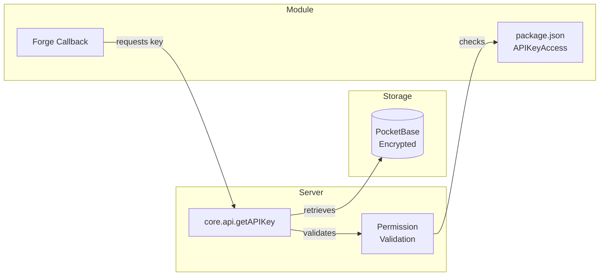

import { Alert } from "lifeforge-ui"

###### API Keys

# Centralized API Key Management

LifeForge provides a secure, centralized vault for managing third-party API keys. Keys are encrypted at rest, and access is controlled through module-level declarations.

---

<section id="overview">
## Overview

The API Key system consists of:

- **Vault** – Encrypted storage in PocketBase (`api_keys__entries` collection)
- **Permission gate** – Modules declare which keys they need in `package.json`
- **UI** – Settings page at `/api-keys` for managing stored keys
- **Client gate** – `APIKeyStatusProvider` blocks module UI if required keys are missing



</section>

<section id="declaring-api-key-access">
## Declaring API Key Access

Modules must declare which API keys they need in their `package.json`:

```json
{
  "name": "@lifeforge/my-module",
  "lifeforge": {
    "icon": "tabler:robot",
    "category": "AI",
    "APIKeyAccess": {
      "openai": {
        "usage": "Used for AI chat completions and embeddings",
        "required": true
      },
      "google-maps": {
        "usage": "Used for location search in address fields",
        "required": false
      }
    }
  }
}
```

| Property | Type | Description |
|----------|------|-------------|
| `usage` | string | Human-readable description shown to users when key is missing |
| `required` | boolean | If `true`, module UI is blocked until key is configured |

<Alert className="mt-6" type="warning">
  Calling `core.api.getAPIKey()` without declaring the key in `APIKeyAccess` will throw an error at runtime. Always declare your required keys.
</Alert>

</section>

<section id="retrieving-api-keys">
## Retrieving API Keys

Use `core.api.getAPIKey()` to retrieve a decrypted key for external SDKs:

```typescript
.callback(async ({ core }) => {
  // Get API key for use with external SDK
  const apiKey = await core.api.getAPIKey('stripe')
  
  const stripe = new Stripe(apiKey)
  // Use stripe SDK...
})
```

<Alert className="mt-6" type="note">
  For AI calls, use `core.api.fetchAI()` instead – it handles key retrieval internally.
</Alert>

</section>

<section id="ai-integration">
## AI Integration

The `core.api.fetchAI()` utility provides structured AI completions with automatic key management:

```typescript
.callback(async ({ pb, core }) => {
  const result = await core.api.fetchAI({
    pb,
    provider: 'openai',       // or 'groq'
    model: 'gpt-4o',
    messages: [{ role: 'user', content: 'Analyze this text' }],
    structure: z.object({     // Optional: enforce response structure
      sentiment: z.enum(['positive', 'negative', 'neutral']),
      confidence: z.number()
    })
  })
  
  return result  // Typed based on structure schema
})
```

### Parameters

| Parameter | Type | Description |
|-----------|------|-------------|
| `pb` | `IPBService` | PocketBase service instance (from callback) |
| `provider` | `'openai' \| 'groq'` | AI provider to use |
| `model` | `string` | Model name (e.g., `gpt-4o`, `llama-3.1-70b-versatile`) |
| `messages` | `array` | Chat messages array |
| `structure` | `ZodSchema?` | Optional Zod schema for structured output |

</section>

<section id="location-search">
## Location Search

The `core.api.searchLocations()` utility provides Google Maps location search:

```typescript
.callback(async ({ core }) => {
  const apiKey = await core.api.getAPIKey('gcloud')
  const locations = await core.api.searchLocations(apiKey, 'coffee shops nearby')
  
  return locations
})
```

</section>

<section id="client-side-gating">
## Client-Side Gating

When you declare `required: true` for an API key in your `package.json`, LifeForge automatically prevents users from accessing your module until that key is configured.

This is handled transparently by the routing system – you don't need to write any client-side code. The `APIKeyStatusProvider` component is injected by the route builder and checks if all required keys exist before rendering your module.

Once the user adds the required keys, the module becomes accessible.


</section>

<section id="managing-keys">
## Managing Keys

Users manage API keys through the Settings > API Keys page (`/api-keys`):

- **Create** – Add new API key with keyId, name, icon, and encrypted value
- **Update** – Modify key metadata or optionally update the key value
- **Delete** – Remove keys no longer needed
- **Exposable flag** – Controls whether key can be retrieved client-side

### Key Properties

| Field | Description |
|-------|-------------|
| `keyId` | Unique identifier used in code (e.g., `openai`, `google-maps`) |
| `name` | Human-readable display name |
| `icon` | Iconify icon name for UI display |
| `key` | The actual API key value (encrypted at rest) |
| `exposable` | If `true`, key can be retrieved via client API |


</section>

<section id="security-model">
## Security Model

| Layer | Protection |
|-------|-----------|
| **At Rest** | Keys encrypted with `MASTER_KEY` environment variable (AES-256) |
| **API Access** | All vault routes require authenticated user |
| **Module Access** | Must declare `APIKeyAccess` in `package.json` to retrieve keys |
| **Client Exposure** | Only `exposable: true` keys can be fetched client-side |
| **Logging** | All key retrievals are logged with caller module info |

### Exposable vs Non-Exposable

| Type | Client API | Server Callback |
|------|------------|-----------------|
| `exposable: true` | ✅ Can retrieve | ✅ Can retrieve |
| `exposable: false` | ❌ 403 Forbidden | ✅ Can retrieve |

<Alert className="mt-6" type="tip">
  Use `exposable: false` for sensitive paid API keys (OpenAI, etc.) that should never reach the browser. Use `exposable: true` only for keys needed client-side like analytics or map SDKs.
</Alert>

</section>

<section id="common-key-i-ds">
## Common Key IDs

These are standard key IDs used across LifeForge modules:

| Key ID | Service | Typical Usage |
|--------|---------|---------------|
| `openai` | OpenAI | AI completions, embeddings, image generation |
| `groq` | Groq | Fast AI inference |
| `google-maps` | Google Maps | Location search, geocoding |
| `pixabay` | Pixabay | Free stock images |
| `unsplash` | Unsplash | High-quality stock photos |

<Alert className="mt-6" type="note">
  You can define custom key IDs for any third-party service. The key ID is just a string identifier used to retrieve the correct key from the vault.
</Alert>

</section>
